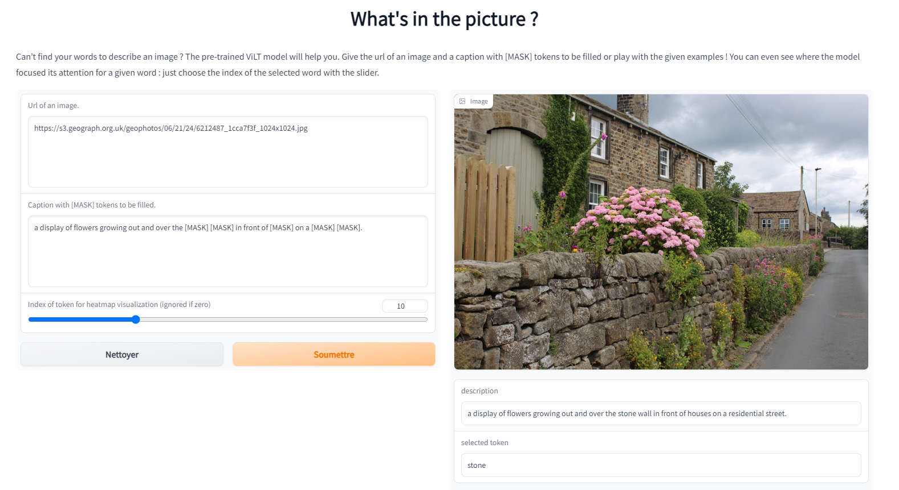

Hi👋🏼, welcome to my first post.

For my first post, I want to introduce to you [Gradio](https://www.gradio.app/). Gradio is a free and open-source Python library that allows you to develop an easy-to-use customizable component demo for your machine learning model that anyone can use anywhere.

With the rise of diffuser models for image generation, AI is democratized and becomes accessible to a larger number of people. It is no longer necessary to have programming skills to be able to experiment with state-of-the-art models: simple web interfaces created by the community allow in a few clicks to have fun with the latest models implemented at Hugging Face 🤗. 

Try this [demo](https://lnkd.in/erYetd5G) that I developed to describe an image using a Transformer model. I developed this demo to answer a request given in Hugging Face's Transformer GitHub repository. The request was to have a tool that reproduces the results we can see in the fig.4 of the [original ViLT paper](https://arxiv.org/abs/2102.03334.pdf).

Short tutorial to get the heatmap that indicates how much information is transported from a chosen word token :

- First, provide the Url of an image and give a caption where you hide the words you want to be filled by a \[MASK\] token.
- Then, choose the index of the token you want to get the heatmap from with the slider bar.

In this example, we chose the first \[MASK\] token (10th word). The result of the heatmap should be the following : 

Thank you for reading my first post ! If you liked this demo, don't hesitate to share it. 

